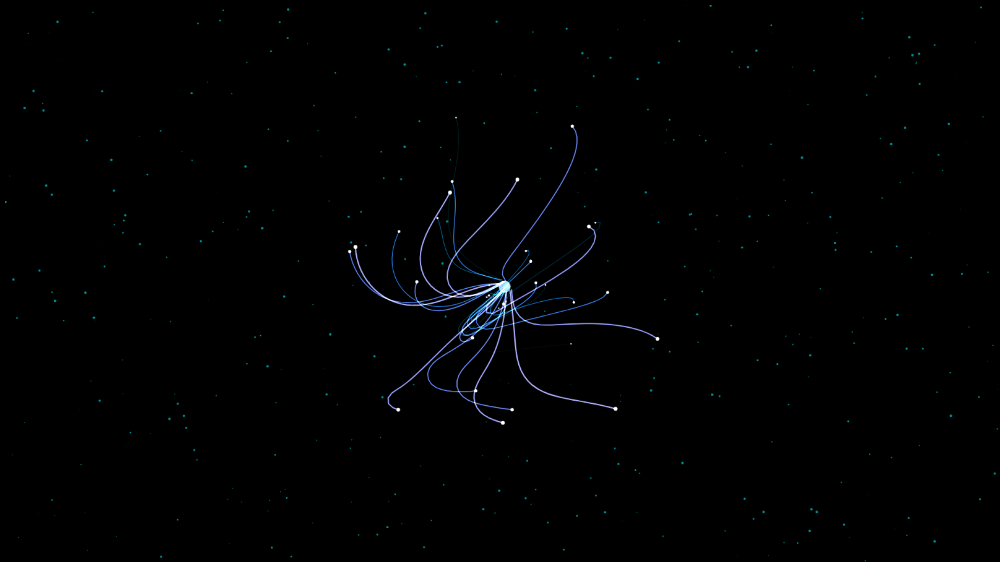
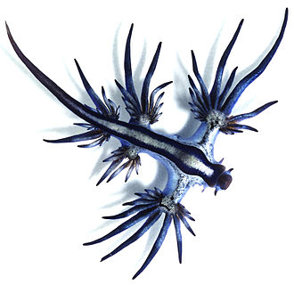
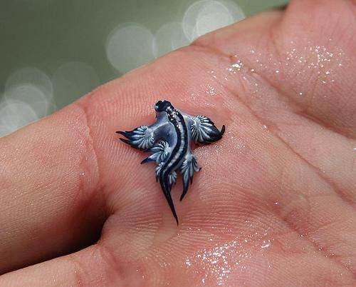
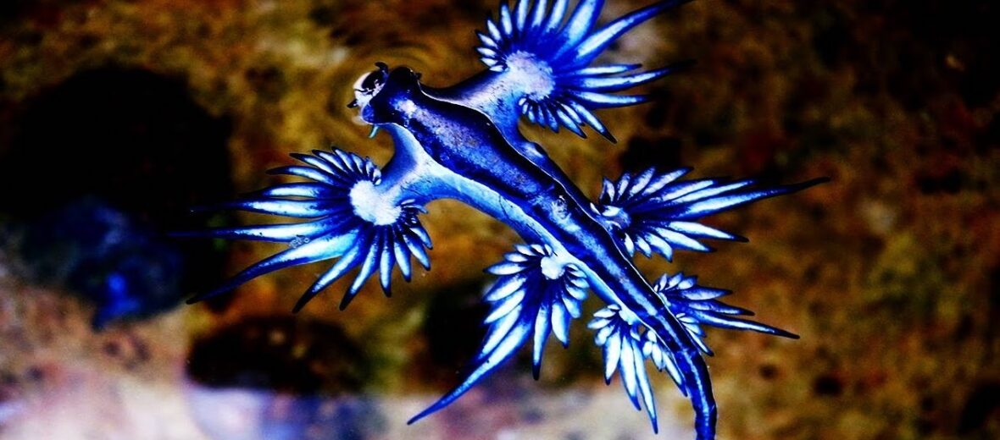

# Sea Dragon Slug 🌊🐉

A **Glaucus Atlanticus** (Blue Dragon Sea Slug) inspired animation built entirely using **HTML, CSS, and JavaScript**.

This project recreates the fluid floating movement of the sea creature with interactive cursor tracking and autonomous idle animation behavior.

---

# ✨ Features

- Pure HTML, CSS, and JavaScript
- Interactive mouse-following animation
- Infinite circular idle loop motion
- Lightweight and dependency-free
- Smooth organic movement
- Responsive animation behavior

---

# 🧠 Technical Overview

This project is built using the HTML5 Canvas API with vanilla JavaScript.

The animation uses a simple procedural movement system where multiple connected segments follow a target position to create smooth organic motion.

Features used in the implementation include:

- `requestAnimationFrame` animation loop
- Mouse tracking interaction
- Trigonometric idle movement using `Math.sin()` and `Math.cos()`
- Dynamic segment-based tentacle animation
- Basic interpolation and motion smoothing
- HSL-based coloring effects

When the cursor leaves the screen, the animation switches to an autonomous looping motion pattern.

---

# 🌐 Live Demo

```txt
https://sea-dragon-cskgxanmo-herry-projects.vercel.app/
```

---

# 📸 Preview



---

# Inspiration






---

# 📁 Project Structure

```bash
Sea-Dragon-Slug/
│
├── index.html
├── style.css
├── script.js
├── README.md
│
└── Resources/
    ├── img0.jpg
    ├── img1.jpg
    ├── img2.jpg
    └── img3.png
```

---

# 🚀 Run Locally

## Option 1 — Open Directly

Open `index.html` in your browser.

---

## Option 2 — VS Code Live Server

1. Install the **Live Server** extension
2. Right-click `index.html`
3. Click **Open with Live Server**

---

# 🛠️ Built With

- HTML5
- CSS3
- Vanilla JavaScript

---

# 👨‍💻 Author

### Herry Patel
